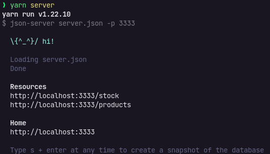
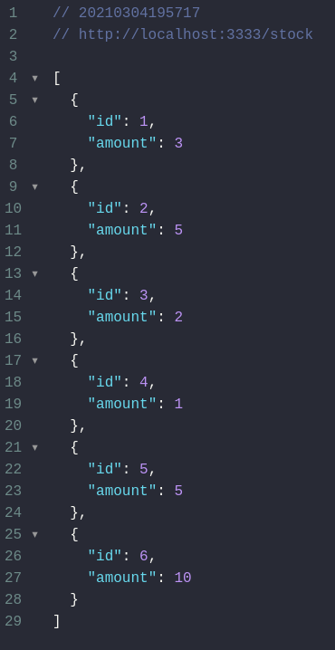
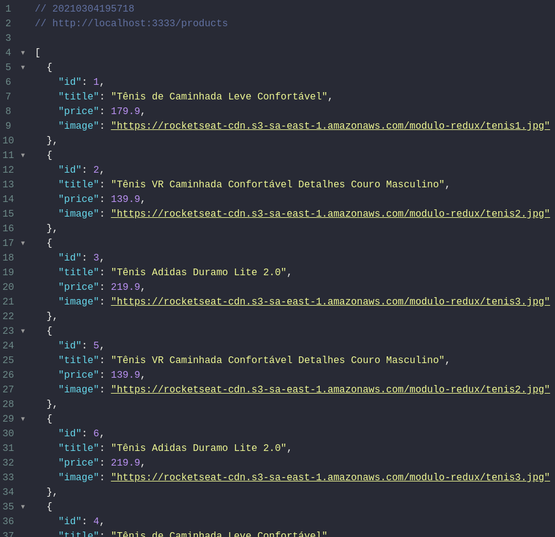

<br />
<br />

<h1 align="center">
  Ignite - Trilha ReactJS
</h2>

<p align="center">
  Chapter02 - Desafio 01 - Criando um hook de carrinho compras
</p>

## Súmario

* [Desafio](#❌-Desafio-✅)
* [Template da aplicação](#-📲-Template-da-aplicação-📌)
* [Tecnologias presentes no desafio](#🖥️-Tecnologias-presentes-no-desafio-📝)
* [Preparando o desafio](#⏱️-Preparando-o-desafio-🔝)
* [Especificação dos testes](#✅-❌-Especificação-dos-testes-🚦)
* [Resultado](#Resultado-🏅)
* [Executando a aplicação](#Executando-a-aplicação-🚀)
* [License](#license)
* [Contato](#📧-contato)

<br />

## ❌ Desafio ✅

Nesse desafio, deverá ser criado uma aplicação para treinar o que foi adquirido de conhecimento até agora na trilha de ReactJS

Será liberado acesso a duas páginas, um componente e um hook para implementar as funcionalidades pedidas nesse desafio:

- Adicionar um novo produto ao carinho;
- Remover um produto do carrinho;
- Alterar a quantidade de um produto no carrinho;
- Cálculo dos preços sub-total e total do carrinho;
- Validação de estoque;
- Exibição de mensagens de erro;
- Entre outros...

<br />
<br />

## 📲 Template da aplicação 📌

- Para ajudar no desafio, o pessoal da Rocketseat criou esse modelo, que pode ser utilizado como template do desafio e ser postado no Github.
- O template está disponível na seguinte url: https://github.com/rocketseat-education/ignite-template-reactjs-criando-um-hook-de-carrinho-de-compras

<br />
<br />

## 🖥️ Tecnologias presentes no desafio 📝

- TypeScript 
- JavaScript 
- HTML 

<br />
<br />

## ⏱️ Preparando o desafio 🔝

- Além de muitos conceitos já tratados em aula, serão utilizados alguns tópicos novos, para deixar a aplicação ainda mais top, como, por exemplo: 

  - Fake API com JSON Server;
  
    <br />

    - Como foi utilizado o MirageJS no módulo 2 aqui do curso (pode ser analisado no repositório do desafio), para simular uma API com os dados das transações da aplicação dt.money, iremos utilizar o JSON Server para simular uma API que possui as informações dos produtos e do estoque.

    <br />
    <br />

    - Nevegar até a pasta criada, abra com um editor de código-fonte de sua preferência ( Eu indico o VS Code, mas fica a seu critério) e execute os seguintes comandos no terminal:

      ```latex
       (sudo) yarn
       (sudo) yarn server
      ```

      <br />

      - Em seguida, aparecerá a seguinte mensagem: 

        

      <br />

      - Perceba que foi iniciado uma fake API com os recursos /stock e /products em localhost na porta 3333 a partir das informações presentes no arquivo server.json, localizado na raiz do projeto. Acessando essas rotas, via navegador, será possível visualizar as seguintes informações, totalmente em JSON: 

      <br />

      - stock

        

      <br />
      <br />

      - products

        

      <br />

      - Para acessar a listagem de todos os produtos e estoque, basta realizar uma requisição GET nas rotas /products e /stock respectivamente. Para acessar os dados de um único item utilize os route params, por exemplo: /products/1 e /stock/1 para acessar os dados do produto e estoque do produto de ID 1, respectivamente.

      <br />
      
      - Dessa forma, basta consumir essas rotas da API normalmente com Axios. Segue link sobre JSON Server, para ler e ficar mais inteirado sobre esse assunto: https://github.com/typicode/json-server

      <br />

    - Preservar dados do carrinho com localStorage API;

    - Para preservar os dados do carrinho mesmo se fecharmos a aplicação, utilizaremos a localStorage API.

    - Essa é uma API que nos permite persisitier os dados no navegador em um esquema de chave-valor (semelhante ao que temos com objetos JSON). Como essa é uma API global, você não precisa importar nada antes de usar.

    - Para salvar os dados, é preciso utilizar o método <span style="color:red">setItem</span>. Como primeiro argumento você deve informar o nome que você quer dar para o registro, no caso desse desafio é  <span style="color:red">obrigatório</span>  utilizar o nome <span style="color:red">@RocketShoes:cart</span>. Já o segundo 
      arqumento é o valor do registro que **obrigatoriamente** precisa estar no formato <span style="color:red">string</span>.
      Exemplo: 

      ```bash
      localStorage.setItem('@RocketShoes:cart', cart)
      ```

    <br /> 

    - Caso queira um valor para reigstro que não esteja no formato <span style="color:red">string</span>, é preciso tratá-lo (ex.: <span style="color:red">JSON.stringify</span>). Isso fará com que um objeto, lista, número ou qualquer outro valor seja convertido para uma string.

    <br />

    - Para recuperar os dados, você deve utilizar o método <span style="color:red">getItem</span> passando como argumento do registro que, no caso desse desafio, é <span style="color:red">obrigatório</span> utilizar como <span style="color:red">@RocketShoes:cart</span>.  Exemplo:

      ```javascript
      const storagedCart = localStorage.getItem('@RocketShoes:cart');
      ```

    - O valor retornado pelo método <span style="color:red">getItem</span> é sempre no formato <span style="color:red">string</span>. Caso, seja preciso utilizar esse dado em outro formato, é preciso tratá-los (ex.: <span style="color:red">JSON.parse</span>). Isso irá converter a informação ao estado original de quando foi salva com o <span style="color:red">JSON.stringify</span>, seja uma lista, um objeto ou um outro tipo de dado.

      - Caso queira conhecer mais sobre o **localStorage API**, basta acessar -> [Windows.localStorage](https://developer.mozilla.org/pt-BR/docs/Web/API/Window/localStorage) 

    <br />

  - Mostrar erros com toastify:

    - Para mostrar os erros em tela, foi utilizado uma **lib** chamada **react-toastify**. Ela auxilia, na mostrragem das informações temporárias e rápidas, de uma forma sútil e bonita.
    - De todos os métodos, utilizamos apenar o error e será obrigatório utilizar mensagens pré-definidas para os testes passarem nas verificações.
    - Para saber e estudar mais sobre -> [react-toastify](https://github.com/fkhadra/react-toastify#readme)

<br />

## ✅ ❌ Especificação dos testes 🚦

* Em cada teste, tem uma breve descrição no que a aplicação deve cumprir para que os testes passem

* Caso você tenha dúvidas quanto ao que são os testes, e como interpretá-los -> Pode dar uma olhada no [FAQ](https://www.notion.so/FAQ-Desafios-ddd8fcdf2339436a816a0d9e45767664).

* para esse desafio, temos os seguintes testes:

  * [Teste components/Header/index.tsx](https://www.notion.so/Teste-components-Header-index-tsx-4c2e827e1b1246e9bbb4c63e6c4e7972)
  * [Testes pages/Home/index.tsx](https://www.notion.so/Testes-pages-Home-index-tsx-8c9b60a771684f60baf9b9c4de5aa8a9)
  * [Testes pages/Cart/index.tsx](https://www.notion.so/Testes-pages-Cart-index-tsx-20a8e0aa574b4a8a8a8a6462bc769094)
  * [Testes hooks/useCart.tsx](https://www.notion.so/Testes-hooks-useCart-tsx-ee1a6dd59bf74599aa8cc518bcda4a17)

<br />
<br />

## Resultado 🏅

<video src="./src/assets/Gravação_de_tela.mov" />

<br />

## Executando a aplicação 🚀

- Efetuar clone repositório => git clone [Chapter02 - Desafio01](https://github.com/BManduca/chapter02_desafio01_ignite_reactjs)
- Acessar o diretório [chapter02_desafio01_ignite_reactjs](https://github.com/BManduca/chapter02_desafio01_ignite_reactjs) => instalar as dependências executando o yarn
- Dar start no servidor => Comando yarn and yarn server.
- Acessar aplicação => localhost:3000 no navegador

<br />

## License

This project is under the MIT license. See the [LICENSE](LICENSE.md) file  for more details.

<br />

## 📧  Contato

[](mailto:brunnomanducarfe@gmail.com) [](https://www.linkedin.com/in/brunno-manduca-b97080118/) 